# StorageCompressAI

**StorageCompressAI** is a microservices architecture for image compression and storage, combining extreme performance (Rust), flexibility (Node.js/Fastify), and scalability (Supabase Storage). The project is fully containerized and production-ready.

---

## 📚 Table of Contents

- [Overview](#overview)
- [Detailed Architecture](#detailed-architecture)
- [Request Flow](#request-flow)
- [Features](#features)
- [Setup: Step by Step](#setup-step-by-step)
- [Environment Variables](#environment-variables)
- [Build & Run with Docker](#build--run-with-docker)
- [API Usage Example](#api-usage-example)
- [Troubleshooting](#troubleshooting)
- [How to Contribute](#how-to-contribute)
- [Scalability & Extensibility](#scalability--extensibility)
- [License](#license)

---

## Overview

StorageCompressAI solves the problem of scalable image compression and storage by decoupling responsibilities into two main services:

- **compressor-engine**: High-performance Rust service, exposed via HTTP, responsible for compressing in-memory images.
- **api-gateway**: Node.js (Fastify) API that receives multipart uploads, validates, orchestrates compression via Rust, and uploads the result to Supabase Storage.

---

## Detailed Architecture

```mermaid
graph TD
    Client[Cliente - Web/Mobile/CLI]
    API[API Gateway - Fastify/Node.js]
    Rust[Compressor Engine - Rust/Axum]
    Supabase[Supabase Storage - Bucket]

    Client -->|POST /api/v1/compress| API
    API -->|HTTP &#40;image, bytes&#41;| Rust
    Rust -->|Compressed image| API
    API -->|Upload| Supabase
    Supabase -->|Public URL| API
    API -->|JSON &#40; URL, stats &#41;| Client
```



- **Service communication**: Pure HTTP, no dependency on queues or messaging.
- **Containerization**: Each service has its own Dockerfile, and `docker-compose.yml` orchestrates everything.
- **Security**: Rate limiting, CORS, type and size validation, and Supabase bucket policies.

---

## Request Flow

1. **Upload**: The client makes a `POST /api/v1/compress` with an image file (multipart/form-data).
2. **Validation**: The API Gateway validates type, size, and format.
3. **Compression**: The file is sent as bytes to the Rust service, which returns the compressed buffer.
4. **Cloud Upload**: The compressed buffer is saved to Supabase Storage.
5. **Response**: The API Gateway returns a JSON with the public URL, original size, compressed size, and compression ratio.

---

## Features

- **Image compression (JPEG, PNG, WebP) via Rust**
- **Secure upload to Supabase Storage**
- **Configurable quality and file name**
- **Configurable rate limiting and CORS**
- **Structured logging (JSON)**
- **Production-ready with Docker**
- **Easily extensible for new formats or authentication**

---

## Setup: Step by Step

### 1. Clone the repository

```bash
git clone https://github.com/WestFS/StorageCompressAI
cd StorageCompressAI
```

### 2. Configure the `.env` file

Create a `.env` file in the project root with:

```env
# Supabase
SUPABASE_URL=https://<your-project>.supabase.co
SUPABASE_KEY=<your-service-key-or-anon-key>
SUPABASE_BUCKET=images

# Rust Service (do not change if using default docker-compose)
RUST_SERVICE_URL=http://compressor-engine:8000
```

> **Important:**  
> For image upload to work, you must create a Row Level Security (RLS) policy in Supabase Storage that allows image uploads according to your application's business rules.  
> See examples and recommendations in the [official Supabase documentation](https://supabase.com/docs/guides/auth/row-level-security).

### 3. Build & Run with Docker

```bash
docker-compose up --build
```

- The API will be at: [http://localhost:3000](http://localhost:3000)
- The Rust service runs internally at `http://compressor-engine:8000`

---

## Environment Variables

| Variable           | Description                              | Example                        |
|--------------------|------------------------------------------|--------------------------------|
| SUPABASE_URL       | Your Supabase project URL                | https://xxxx.supabase.co       |
| SUPABASE_KEY       | Supabase anon or service key             | xxxxxxxx                       |
| SUPABASE_BUCKET    | Storage bucket name                      | images                         |
| RUST_SERVICE_URL   | Rust service URL (internal)              | http://compressor-engine:8000  |

---

## Build & Run with Docker

- The `docker-compose.yml` defines two services: `compressor-engine` (Rust) and `api-gateway` (Node.js).
- The Rust build is multi-stage, ensuring a slim and compatible (GLIBC) binary.
- Fastify installs only production dependencies.

**Single command:**
```bash
docker-compose up --build
```

---

## API Usage Example

### Image compression and upload

```bash
curl http://localhost:3000/api/v1/compress \
  -F "image=@/path/to/your/image.png" \
  -F "quality=85" \
  -F "fileName=compressed-image.jpg"
```

**Expected response:**
```json
{
  "url": "https://<your-project>.supabase.co/storage/v1/object/public/images/compressed-image.jpg",
  "key": "images/compressed-image.jpg",
  "size": 12345,
  "originalSize": 45678,
  "compressionRatio": "3.70"
}
```

---

## Troubleshooting

### Error: `"new row violates row-level security policy"`

- In the Supabase panel → **Storage** → your bucket → **Policies**.
- For testing, create an `INSERT` policy with:
  ```sql
  true
  ```
- **In production, create a policy appropriate for your application!**
- See RLS examples at: [Supabase RLS Docs](https://supabase.com/docs/guides/auth/row-level-security)

### Error: `"Compression failed: Failed to buffer the request body: length limit exceeded"`

- The uploaded file is larger than the limit set in the Rust service.
- In Rust's `src/main.rs`, increase the limit:
  ```rust
  .layer(DefaultBodyLimit::max(20 * 1024 * 1024)) // 20 MB, for example
  ```
- Rebuild and restart.

### Error: `MODULE_NOT_FOUND` for Node.js dependencies

- Make sure all dependencies are in `package.json`.
- Run `docker-compose up --build` to force reinstall.

---

## How to Contribute

Pull requests are welcome! For major changes, please open an issue first to discuss what you would like to change.

### Commit Convention

Use the [Conventional Commits](https://www.conventionalcommits.org/en/v1.0.0/) standard:

- `feat: ...` for new features
- `fix: ...` for bug fixes
- `docs: ...` for documentation changes
- `refactor: ...` for code refactoring
- `test: ...` for adding or updating tests

Example:
```
feat(api): add image compression endpoint

fix(storage): fix upload policy on Supabase
```

---

## 🚀 Scalability & Extensibility

This project is designed to be simple, robust, and easy to evolve. While the current version focuses on JPEG compression via Rust and upload to Supabase, the decoupled architecture allows for:

- **Adding new compression formats:**  
  The Rust service can be extended to support other formats (e.g., AVIF, HEIC, JPEG XL) by adding or swapping crates in `lib.rs`, without impacting the rest of the system.

- **Switching or combining compression engines:**  
  You can implement multiple algorithms (e.g., use `image` for JPEG, `ravif` for AVIF) and select via API parameter, keeping the same HTTP interface.

- **Adding authentication and authorization:**  
  The API Gateway (Fastify) can be easily integrated with JWT, OAuth, or other strategies, without changing the Rust service.

- **Horizontal scaling:**  
  Since each service is stateless and containerized, just increase the number of replicas in Docker Compose, Kubernetes, or another orchestrator.

- **Integrating with other storages:**  
  The upload can be adapted for other providers (S3, GCS, Azure Blob) by changing only the Node.js service layer.

- **Adding monitoring and alerts:**  
  The `/metrics` endpoint already exposes data for Prometheus, making integration with Grafana and alerting systems easy.

> **Note:**  
> During development, several approaches and compression crates were tested (e.g., `mozjpeg`, `zune-image`, etc.), but stability and simplicity were prioritized in the current version.  
> The project remains open for evolution as new needs or technologies arise.

---

## License

MIT 
