# StorageCompressAI

**StorageCompressAI** é uma arquitetura de microsserviços para compressão e armazenamento de imagens, combinando performance extrema (Rust), flexibilidade (Node.js/Fastify) e escalabilidade (Supabase Storage). O projeto é totalmente containerizado e pronto para produção.

---

## 📚 Sumário

- [Visão Geral](#visão-geral)
- [Arquitetura Detalhada](#arquitetura-detalhada)
- [Fluxo de Requisição](#fluxo-de-requisição)
- [Features](#features)
- [Setup: Passo a Passo](#setup-passo-a-passo)
- [Variáveis de Ambiente](#variáveis-de-ambiente)
- [Build & Execução com Docker](#build--execução-com-docker)
- [Exemplo de Uso da API](#exemplo-de-uso-da-api)
- [Resolução de Problemas](#resolução-de-problemas)
- [Como Contribuir](#como-contribuir)
- [Licença](#licença)

---

## Visão Geral

O StorageCompressAI resolve o problema de compressão e armazenamento de imagens em escala, desacoplando as responsabilidades em dois serviços principais:

- **compressor-engine**: Serviço Rust de alta performance, exposto via HTTP, responsável por comprimir imagens recebidas em memória.
- **api-gateway**: API Node.js (Fastify) que recebe uploads multipart, valida, orquestra a compressão via Rust e faz upload do resultado para o Supabase Storage.

---

## Arquitetura Detalhada

```mermaid
graph TD
    Client[Cliente - Web/Mobile/CLI]
    API[API Gateway - Fastify/Node.js]
    Rust[Compressor Engine - Rust/Axum]
    Supabase[Supabase Storage - Bucket]

    Client -->|POST /api/v1/compress| API
    API -->|HTTP &#40;image, bytes&#41;| Rust
    Rust -->|Compressed image| API
    API -->|Upload| Supabase
    Supabase -->|Public URL| API
    API -->|JSON &#40; URL, stats &#41;| Client
```



- **Comunicação entre serviços**: HTTP puro, sem dependência de filas ou mensageria.
- **Containerização**: Cada serviço tem seu próprio Dockerfile, e o `docker-compose.yml` orquestra tudo.
- **Segurança**: Rate limit, CORS, validação de tipos e tamanho, e políticas de bucket no Supabase.

---

## Fluxo de Requisição

1. **Upload**: O cliente faz um `POST /api/v1/compress` com um arquivo de imagem (multipart/form-data).
2. **Validação**: O API Gateway valida tipo, tamanho e formato.
3. **Compressão**: O arquivo é enviado como bytes para o serviço Rust, que retorna o buffer comprimido.
4. **Upload Cloud**: O buffer comprimido é salvo no Supabase Storage.
5. **Resposta**: O API Gateway retorna um JSON com a URL pública, tamanho original, tamanho comprimido e razão de compressão.

---

## Features

- **Compressão de imagens (JPEG, PNG, WebP) via Rust**
- **Upload seguro para Supabase Storage**
- **Configuração de qualidade e nome do arquivo**
- **Rate limiting e CORS configuráveis**
- **Logs estruturados (JSON)**
- **Pronto para produção com Docker**
- **Fácil extensão para novos formatos ou autenticação**

---

## Setup: Passo a Passo

### 1. Clone o repositório

```bash
git clone https://github.com/WestFS/StorageCompressAI
cd StorageCompressAI
```

### 2. Configure o arquivo `.env`

Crie um arquivo `.env` na raiz do projeto com:

```env
# Supabase
SUPABASE_URL=https://<seu-projeto>.supabase.co
SUPABASE_KEY=<sua-service-key-ou-anon-key>
SUPABASE_BUCKET=images

# Serviço Rust (não altere se usar docker-compose padrão)
RUST_SERVICE_URL=http://compressor-engine:8000
```

> **Importante:**  
> Para que o upload de imagens funcione, você deve criar uma policy de RLS (Row Level Security) no Supabase Storage que permita o envio de imagens conforme a regra de negócio da sua aplicação.  
> Consulte exemplos e recomendações na [documentação oficial do Supabase](https://supabase.com/docs/guides/auth/row-level-security).

### 3. Build e execução com Docker

```bash
docker-compose up --build
```

- A API estará em: [http://localhost:3000](http://localhost:3000)
- O serviço Rust roda internamente em `http://compressor-engine:8000`

---

## Variáveis de Ambiente

| Variável           | Descrição                                 | Exemplo                        |
|--------------------|-------------------------------------------|--------------------------------|
| SUPABASE_URL       | URL do seu projeto Supabase               | https://xxxx.supabase.co       |
| SUPABASE_KEY       | Chave anon ou service do Supabase         | xxxxxxxx                       |
| SUPABASE_BUCKET    | Nome do bucket de storage                 | images                         |
| RUST_SERVICE_URL   | URL do serviço Rust (interno)             | http://compressor-engine:8000  |

---

## Build & Execução com Docker

- O `docker-compose.yml` define dois serviços: `compressor-engine` (Rust) e `api-gateway` (Node.js).
- O build do Rust é multi-stage, garantindo binário enxuto e compatível (GLIBC).
- O Fastify instala apenas dependências de produção.

**Comando único:**
```bash
docker-compose up --build
```

---

## Exemplo de Uso da API

### Compressão e upload de imagem

```bash
curl http://localhost:3000/api/v1/compress \
  -F "image=@/caminho/para/sua/imagem.png" \
  -F "quality=85" \
  -F "fileName=imagem-comprimida.jpg"
```

**Resposta esperada:**
```json
{
  "url": "https://<seu-projeto>.supabase.co/storage/v1/object/public/images/imagem-comprimida.jpg",
  "key": "images/imagem-comprimida.jpg",
  "size": 12345,
  "originalSize": 45678,
  "compressionRatio": "3.70"
}
```

---

## Resolução de Problemas

### Erro: `"new row violates row-level security policy"`

- No painel do Supabase → **Storage** → seu bucket → **Policies**.
- Para testes, crie uma policy de `INSERT` com:
  ```sql
  true
  ```
- **Em produção, crie uma policy adequada à sua aplicação!**
- Veja exemplos de RLS em: [Supabase RLS Docs](https://supabase.com/docs/guides/auth/row-level-security)

### Erro: `"Compression failed: Failed to buffer the request body: length limit exceeded"`

- O arquivo enviado é maior que o limite configurado no serviço Rust.
- No `src/main.rs` do Rust, aumente o limite:
  ```rust
  .layer(DefaultBodyLimit::max(20 * 1024 * 1024)) // 20 MB, por exemplo
  ```
- Rebuild e suba novamente.

### Erro: `MODULE_NOT_FOUND` para dependências Node.js

- Certifique-se de que todas as dependências estão no `package.json`.
- Rode `docker-compose up --build` para forçar reinstalação.

---

## Como Contribuir

Pull requests são bem-vindos! Para grandes mudanças, por favor abra uma issue primeiro para que possamos discutir o que você gostaria de modificar.

### Padrão de Commits

Use o padrão [Conventional Commits](https://www.conventionalcommits.org/en/v1.0.0/):

- `feat: ...` para novas funcionalidades
- `fix: ...` para correções de bugs
- `docs: ...` para mudanças na documentação
- `refactor: ...` para refatorações de código
- `test: ...` para adição ou ajuste de testes

Exemplo (Português):

```
feat(api): adicionar endpoint de compressão de imagem

fix(storage): corrigir policy de upload no Supabase
```

Example (English):

```
feat(api): add image compression endpoint

fix(storage): fix upload policy on Supabase
```

---

## Licença

Este projeto é licenciado sob a licença MIT. Consulte o arquivo [LICENSE](LICENSE) para mais detalhes.
